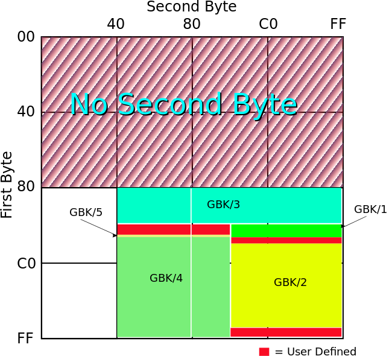

# hzk16
hzk16是符合GBK的16x16点阵字库，每个字符16x16个pixel，使用32bytes来存储；
该字库包含了GBK1（非汉字区）和GBK2（含子区）两个区域：
* GBK/1	A1–A9	A1–FE
* GBK/2	B0–F7	A1–FE


## 计算方法
获取汉字的GBK编码（两个字节）AB，该汉字在字库文件中的偏移地址
```
offset = [(A-0xA1)*94 + (B-0xA1)] * 32
```